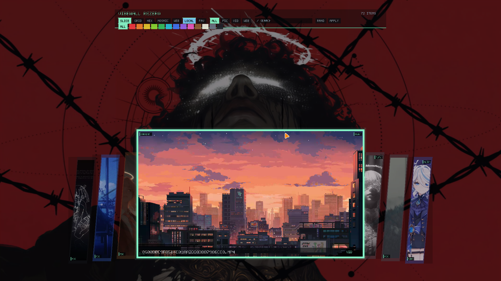
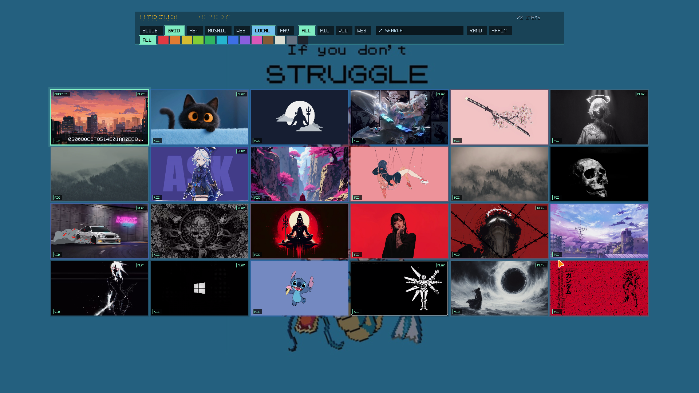
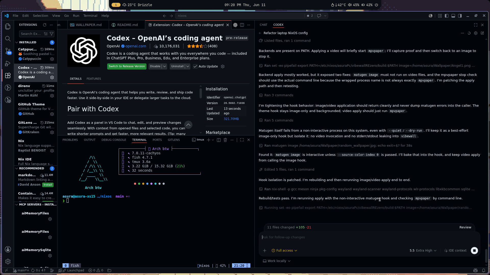
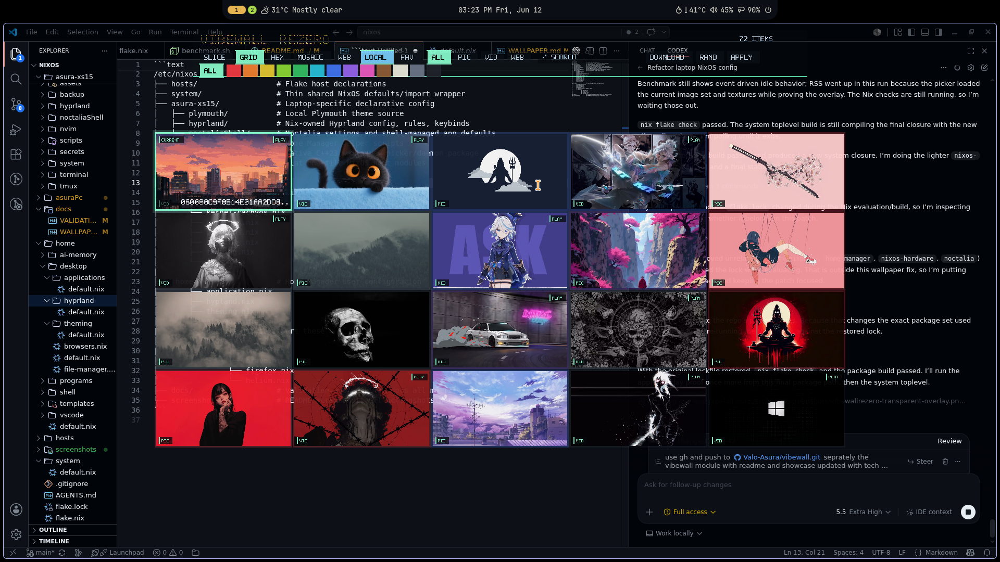

# vibewall

Native C++23 wallpaper picker/daemon for Wayland. This repo currently carries
the Asura XS15 `vibewallREzero` implementation, packaged as the `vibewall`
command-line workflow.

> [!WARNING]
> This project is mostly vibecoded, young, and absolutely breakable. It can
> launch shell tools, change wallpapers, kill `mpvpaper`, write SQLite/cache
> state, and talk to Wallhaven. Use it at your own risk, read the code first,
> and keep a terminal open when testing new builds.

## Inspiration

- `skwd-wall`: workflow/reference behavior for slice, grid, and hex picker
  modes.
- Noctalia: active shell IPC target for static wallpaper apply.
- `mpvpaper`: video wallpaper backend.
- Wallhaven: remote search/download/apply flow.

## Tech Stack

| Layer | Packages / APIs |
|---|---|
| Language | C++23 |
| Build | Meson, Ninja, pkg-config |
| Wayland UI | `wayland-client`, `wlr-layer-shell`, `wayland-egl`, `xkbcommon` |
| Rendering | EGL, OpenGL ES 2 |
| Images | libvips |
| Video thumbnails | ffmpeg |
| Data | SQLite |
| HTTP / JSON | libcurl, nlohmann-json |
| Config | toml++ |
| Wallpaper backends | Noctalia IPC, `mpvpaper`, `matugen` |
| Nix | Nix package plus NixOS module |

## Features

- Tiny daemon plus short-lived native picker.
- Native transparent Wayland layer-shell overlay with OpenGL ES rendering.
- Reference-inspired modes: slice carousel, grid, hex, mosaic, and Wallhaven browser.
- Systemd-backed `vibewall toggle` startup, so the first `SUPER+W` press opens
  the picker instead of only waking the daemon.
- Click outside the centered picker stage to close.
- Full-opacity wallpaper previews with aspect-ratio cover cropping.
- Transparent background: the active workspace/app stays visible behind the
  centered picker; only toolbar/cards draw translucent panels.
- SQLite wallpaper database with tags, favourites, filters, colour groups, and
  last-used restore state.
- Image thumbnails through libvips and video thumbnails through ffmpeg.
- Wallhaven paginated search/cache/download/apply.
- Wallhaven card click selects only; `DOWNLOAD`/`D` saves the remote image, and `APPLY`/`Enter` downloads then applies it.
- Image backend: `noctalia msg wallpaper-set`.
- Video backend: `mpvpaper`.
- Theme hook: `matugen image`.

## Non-Goals

No Qt, QML, Quickshell, GTK, Tauri, Electron, WebKit, Steam Workshop,
Wallpaper Engine scene support, or local AI tagging. The daemon stays IPC-only;
heavy rendering/indexing happens in short-lived tools.

## Build

```bash
meson setup build
meson compile -C build
meson test -C build
```

## Commands

```bash
vibewall scan
vibewall toggle
vibewall picker --mode slice
vibewall picker --mode grid
vibewall picker --mode hex
vibewall picker --mode mosaic
vibewall picker --wallhaven
vibewall apply /path/to/wallpaper.png
vibewall random
vibewall restore
vibewall wallhaven search "city night" --page 1
```

## Picker Keys

| Key | Action |
|---|---|
| `1` | Slice mode |
| `2` | Grid mode |
| `3` | Hex mode |
| `4` | Mosaic mode |
| `Left/Right/Up/Down` | Navigate |
| `Enter` | Apply selected; Wallhaven downloads then applies |
| `D` | Download selected Wallhaven wallpaper without applying |
| `F` | Toggle favourite |
| `W` | Search/cache Wallhaven and show remote previews |
| `L` | Return to local wallpapers |
| `R` | Apply random wallpaper |
| `/` | Edit search |
| `Backspace` | Delete search char |
| `Escape` / outside click | Close |

## Screenshots

| Slice | Grid |
|---|---|
|  |  |

| Hex | Video wallpaper |
|---|---|
|  |  |

| Mosaic | Wallhaven |
|---|---|
|  |  |

| Transparent overlay |
|---|
|  |

## NixOS

The module at `nix/module.nix` installs the package, enables the user daemon,
and exposes a `programs.vibewallREzero` option set.

In this NixOS repo it lives at:

```text
/etc/nixos/asura-xs15/vibewallREzero
```

## Performance

The daemon intentionally does not link Wayland/EGL/OpenGL/libvips/curl UI
paths. Heavy indexing, thumbnailing, Wallhaven, and rendering happen in
short-lived processes.

Run:

```bash
benchmark.sh
```

Recent package benchmark on the Asura XS15:

```text
daemon_rss_kb=2844
picker_startup_ms=1642
picker_ready_rss_kb=252828
picker_idle_cpu_ticks_10s=0
idle_redraw_policy=event-driven
```

## Safety Notes

- Paths are passed as argv vectors, not shell-concatenated command strings.
- Wallhaven API keys belong in local config only; do not commit real keys.
- The picker is a privileged user-session tool in practice: it can apply
  wallpapers and spawn configured hooks, so review `config/default.toml` before
  using third-party configs.
